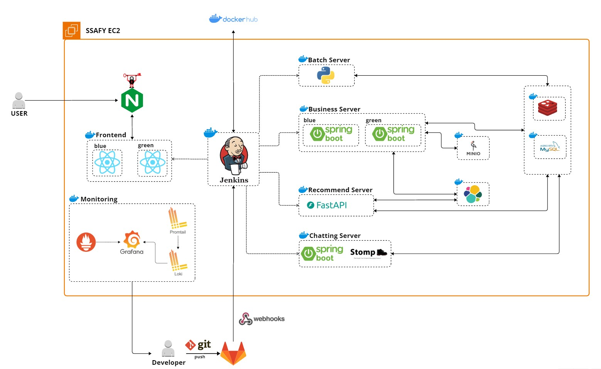
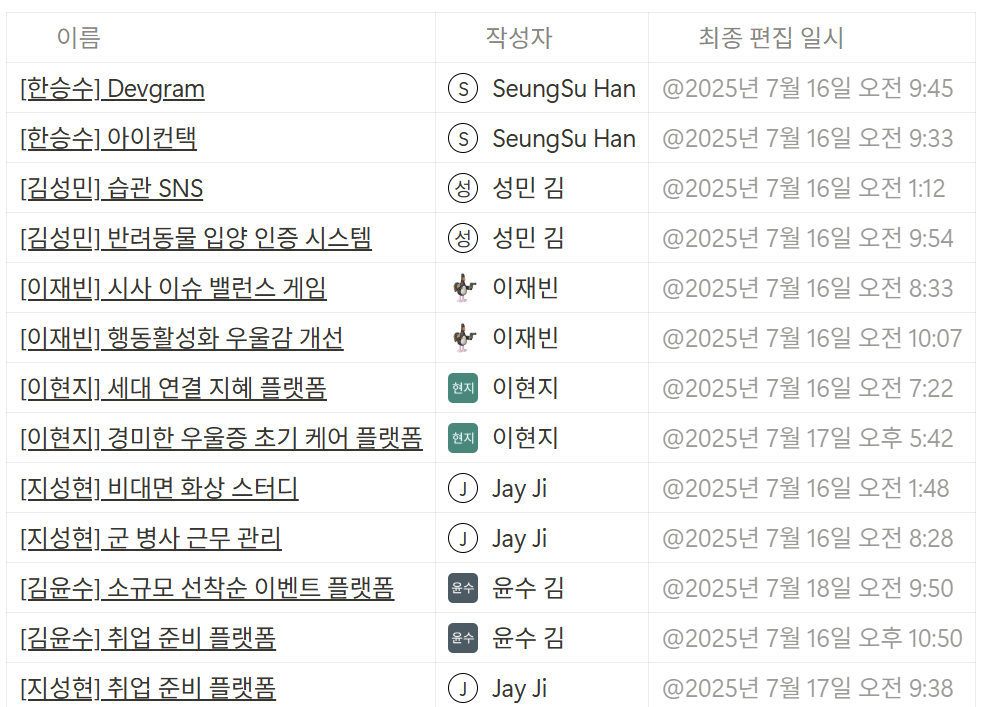
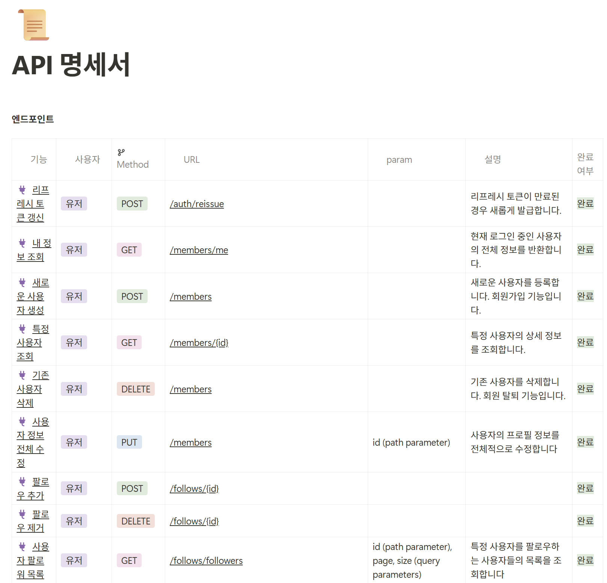
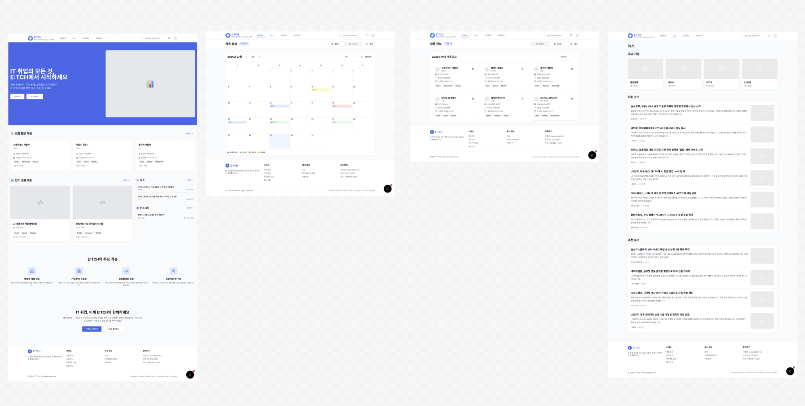

# ETCH (엣취!)-README

> ***“Everyone 취업!”***
IT 취업 준비생을 위한 통합 취업 지원 플랫폼
> 

프로젝트 기간 : 2025.07 ~ 2025.08

**[✨Notion README 보러가기✨](https://antique-beechnut-31b.notion.site/ETCH-README-248b4441359c80f38e5fccf2413416f6?source=copy_link)**

---

# 🔗프로젝트 링크

<aside>

💡[**ETCH - Everyone, 취업! 엣취!**](https://etch.it.kr)

</aside>

# 👥 팀 구성

| 역할 | 이름 | 담당 업무 |
| --- | --- | --- |
| **팀장 & 인프라** | **한승수** | **CI/CD 구축, 서버 관리, DevOps** |
| **백엔드 [리드]** | **김윤수** | **백엔드 아키텍처 설계, 핵심 API 개발** |
| **백엔드** | **이재빈** | **OAuth 인증, 추천 기능, API 개발** |
| **백엔드** | **이현지** | **배치 시스템, Redis 캐싱, 데이터 수집, API 개발** |
| **프론트엔드 [리드]** | **지성현** | **프론트엔드 아키텍처, UI/UX 설계** |
| **프론트엔드** | **김성민** | **컴포넌트 개발, 사용자 인터페이스 구현** |

---

# 📋프로젝트 관리

## [Jira↗️](https://ssafy.atlassian.net/jira/software/c/projects/S13P11A402/summary)

- 스프린트 기반 일정 관리
- BE/FE/Infra 별 업무 분담
- 스토리 포인트 기반 작업량 추정
- 매주 월요일 작업 계획 수립

## [GitLab Repo↗️](https://lab.ssafy.com/s13-webmobile1-sub1/S13P11A402)

- Git Flow 적용 (master, dev, feat)
- Jira task를 통한 branch 생성

## [Notion↗️](https://www.notion.so/22a1a1b1012f809f96ecefba833c1fe9?pvs=21)

- 프로젝트 회의록 및 공유 문서 관리
- 팀 규칙 (그라운드 룰, 회의 룰) 명시
- 컨벤션 정리 (Git, Code, Naming, Jira, DB)
- 명세서 관리 (기능, API, ERD)
- 환경변수 및 설정 값 관리

---

# 🗺️ 프로젝트 아키텍쳐

## 시스템 아키텍처 구성

**🔄 CI/CD Pipeline**
- **Jenkins**: Git Webhook을 통한 자동 빌드/배포
- **Docker Hub**: 컨테이너 이미지 저장소
- **Git**: GitLab을 통한 소스코드 관리

**🌐 Frontend (React)**
- **Nginx**: 리버스 프록시 및 로드 밸런서
- **Blue-Green 배포**: 무중단 배포 전략 적용
- **사용자 접근점**: SSAFY EC2를 통한 서비스 제공

**🏗️ Backend Microservices**
- **Business Server**: Spring Boot 기반 핵심 비즈니스 로직 (Blue-Green 배포)
- **Batch Server**: Python 기반 주기적 데이터 수집 및 처리
- **Recommend Server**: FastAPI 기반 개인 맞춤형 추천 시스템
- **Chatting Server**: Spring Boot + STOMP 기반 실시간 채팅

**💾 Data Storage**
- **MySQL**: 메인 관계형 데이터베이스
- **Redis**: 캐싱 및 세션 관리, 채팅 메시지 저장
- **MinIO**: S3 호환 객체 스토리지 (파일 업로드)

**📊 Monitoring & Logging**
- **Grafana**: 시스템 모니터링 대시보드
- **Promtail & Loki**: 로그 수집 및 분석

## 서버별 기술 스택 상세

| 구분 | 기술 스택 |
|------|-----------|
| **Frontend** | React, Typescript, Vite |
| **Batch Server** | Python, Redis(인기 Top10 캐싱), MySQL(공고/뉴스/기업 데이터 저장) |
| **Business Server** | Spring Boot, MySQL(메인 DB), Redis(Refresh 토큰), MinIO(이미지 저장), OAuth(google OAuth), JWT(Access/Refresh Token), Elasticsearch(통합 검색, 인덱스/필터 적용) |
| **Chatting Server** | Spring Boot, MySQL(채팅 내역 저장), Redis(채팅방 pub/sub 구조), STOMP(메시지 규약) |
| **Recommend Server** | Python FastAPI, Redis(추천 데이터 캐싱), MySQL(사용자 데이터 추출), Elasticsearch(인덱스 데이터 추출) |
| **CI/CD** | Jenkins, Nginx(certbot 활용 SSL 과 https 적용), 블루/그린 배포를 통한 무중단 배포, gitlab webhook 활용 CI, CD 후 MM 알림 |
| **Monitoring** | Prometheus, Grafana, Promtail, Loki |

---

# ❤️ 주요 서비스 소개

## 공고/기업/뉴스 정보를 한 눈에
- 사람인 API, 전자공시 API, News API 데이터를 Batch server를 통해 주기적으로 호출
- 데이터 전처리 과정을 통하여 프로젝트 최적화 후 DB에 저장
- 사용자 중심적 UI/UX 설계

## 개인/맞춤형 추천 서비스
- 사용자 활동 데이터 기반 맞춤형 채용 공고 및 뉴스 아이템 제공
- 단어 기반 추천율 매칭
- TF-IDF+LSA 방식을 통해 추천 유사도 매칭률을 증가

## 자소서/포트폴리오 작성
- 대표 자기소개서 질문에 대한 작성 가이드라인 제공
- 포트폴리오 작성 양식 제공
- 포트폴리오 작성 시 업로드한 프로젝트 내용 선택적 첨부 가능

## 프로젝트 SNS
- GitHub보다 가벼운 프로젝트 소개 커뮤니티
- 소스코드를 올리는 것이 아닌 프로젝트 관련 사진과 설명, 링크 등을 올려 프로젝트를 소개
- 프로젝트 아이디어 영감 및 인적 네트워킹 형성

---

# ✨ 주요 기술 소개

## ✅ 뉴스/채용공고/기업정보 최적화
- Job Scheduler & Redis RR 기법을 활용한 주기적인 데이터 업데이트
- 사용자 선호도 기반 TOP10 기업 추출 후 Redis 캐싱

## ✅ 실시간 채팅
- Spring Boot + STOMP + Redis 를 사용하여 채팅 서버 구현
- Redis pub/sub 구조를 통한 채팅방 구독 시스템 적용

## ✅ 검색 시스템
- Elasticsearch를 사용하여 통합 검색 및 인덱스/필터 최적화
- Logstash 를 통한 ES↔DB 데이터 동기화 (멱등성 보장)

## ✅ 추천 시스템
- 단어 등장 빈도 기반 추천 → TF-IDF 방식
- TF-IDF에서 LSA연산 추가
  - 추가 전: 0.4 유사도 → 추가 후: 0.8 유사도

---

# ⚡주차별 업적

## 🗓1주차~2주차 - 주제 선정

- **주제 선정**: 13번의 주제 회의, 30개 아이디어 도출

- **최종 주제**: ***“통합 취업 지원 플랫폼 서비스”***
    
    > **ETCH (엣취!)**는 IT 취업 준비생들이 한 곳에서 모든 취업 준비를 할 수 있는 통합 플랫폼입니다. 채용 정보 제공부터 개인 맞춤 추천, 프로젝트 SNS, 자소서/포트폴리오 작성 지원까지 취업 준비에 필요한 모든 기능을 제공합니다.
    > 
    

## 📄3주차 - 명세서 작성

### **기능 명세서**

| 역할        | 통합 채용 정보                                                                                        | 맞춤형 콘텐츠 추천                                               | 프로젝트 SNS                                                   | 취준 어시스턴트                                                                      |
| --------- | ----------------------------------------------------------------------------------------------- | -------------------------------------------------------- | ---------------------------------------------------------- | ----------------------------------------------------------------------------- |
| 기능 명세서 작성 | - 다중 API (사람인 API, NewsAPI, DartAPI) 기반 데이터 수집 - ElasticSearch 기반 통합 검색 기능 - 실시간 채용 알림 전송 | - 사용자 관심 분야 및 활동 기반 추천 알고리즘 - 맞춤형 채용 공고, 뉴스, 기업 정보 제공 | - 프로젝트 공유 및 팀원 모집 플랫폼 - 커뮤니티 기반 개발자 네트워킹 - 실시간 채팅 기능 | - AI 기반 자기소개서/포트폴리오 작성 지원 - 개인 맞춤형 가이드라인 및 템플릿 제공 - 대시보드 기반 취업 준비 현황 분석 |

### **API 명세서**

### **UI/UX**

### **ERD 설계**

## 데이터베이스 구조

| 카테고리 | 테이블명 | 설명 |
|---------|----------|------|
| **👤 사용자 관리** | member | 사용자 기본 정보 (로그인, 권한 등) |
| | profile | 사용자 프로필 상세 정보 |
| | tech_stack | 사용자별 기술 스택 관리 |
| **💼 채용 정보** | job | 채용 공고 정보 (사람인 API 연동) |
| | company | 기업 정보 (전자공시 API 연동) |
| | job_scrap | 사용자별 채용 공고 스크랩 |
| **📰 뉴스 & 콘텐츠** | news | IT 뉴스 정보 (News API 연동) |
| | news_scrap | 사용자별 뉴스 스크랩 |
| **🚀 프로젝트 & 포트폴리오** | project | 프로젝트 정보 및 SNS 기능 |
| | project_tech | 프로젝트별 사용 기술 |
| | project_comment | 프로젝트 댓글 |
| | portfolio | 사용자 포트폴리오 |
| | portfolio_project | 포트폴리오-프로젝트 연결 |
| **💬 채팅 시스템** | chatting | 실시간 채팅방 관리 |
| | chat_participant | 채팅방 참여자 |
| | chat_message | 채팅 메시지 |
| **🎯 추천 시스템** | recommend | TF-IDF + LSA 기반 개인 맞춤 추천 |
| | user_activity | 사용자 활동 로그 (추천 알고리즘 학습용) |

---

## 🔧4주차 - CI/CD 구축 및 개발 시작

| 역할 | 담당자 | 주요 업무 |
|------|--------|-----------|
| **🏗️ 인프라 & DevOps** | **한승수 (팀장 & 인프라)** | • Jenkins CI/CD 파이프라인 구축 • GitLab Webhook 연동 자동화 • Nginx 리버스 프록시 설정 |
| **💻 백엔드 개발** | **김윤수 (백엔드 리드)** | • 기본 CRUD 구현 • ElasticSearch 테스트 및 설정 • ERD 조정 및 백엔드 업무 분담 조정 |
| | **이재빈 (백엔드)** | • 기본 CRUD 구현 • Google OAuth 연동 시스템 구축 • JWT Token 적용 (Access, Refresh Token) |
| | **이현지 (백엔드)** | • 기본 CRUD 구현 • 코스피, 코스닥 기준 주요 회사 정리 • 회사별 NewsAPI 호출 서버 구축 • Redis 활용 인기 Top10 기능 구현 |
| **🎨 프론트엔드 개발** | **지성현 (프론트엔드 리드)** | • 변형 Atomic Design 패턴 적용 (atoms → molecules → organisms → pages → layout) • React Router 페이지 관리 (SPA 라우팅 및 코드 스플리팅) |
| | **김성민 (프론트엔드)** | • 변형 Atomic Design 패턴 적용 (atoms → molecules → organisms → pages → layout) • React Router 페이지 관리 (SPA 라우팅 및 코드 스플리팅) |

## 🎯5주차 - 집중 개발 기간

| 역할 | 담당자 | 주요 업무 |
|------|--------|-----------|
| **🏗️ 인프라 & DevOps** | **한승수 (팀장 & 인프라)** | • Prometheus와 Grafana를 적용하여 모니터링 시스템 구축 • 빌드/배포 시간 최적화 • 블루/그린 배포 전략 적용 |
| **💻 백엔드 개발** | **김윤수 (백엔드 리드)** | • 검색 API 구현 • ElasticSearch 적용 및 최적화 • ChattingServer 작업 |
| | **이재빈 (백엔드)** | • 자소서/포트폴리오 API 구현 • RecommendServer 작업 |
| | **이현지 (백엔드)** | • ERD 정규화 작업 • JPQL 쿼리 최적화 • 프로젝트 API 구현 |
| **🎨 프론트엔드 개발** | **지성현 (프론트엔드 리드)** | • 프로젝트/뉴스/인기/채용/좋아요 API 연결 • 주요 모달창 구현 |
| | **김성민 (프론트엔드)** | • 메인페이지 레이아웃 구현 • OAuth 연결 • 검색/뉴스/프로젝트/채용/파일 API 연결 |

## 🏆6주차 - 프로젝트 완성

| 역할 | 담당자 | 주요 업무 |
|------|--------|-----------|
| **🏗️ 인프라 & DevOps** | **한승수 (팀장 & 인프라)** | • Gradle 캐싱 활용 빌드/배포 시간 단축 • 블루/그린 배포(Frontend, Business Server) 적용 → 무중단 배포 • 실시간 채팅 서버 구현 • 최종 시스템 모니터링 및 안정화 |
| **💻 백엔드 개발** | **김윤수 (백엔드 리드)** | • Elasticsearch 인덱싱 최적화 및 필터 구현 • 분석/통계 API 개발 • 채용 공고 데이터 전처리 완성 |
| | **이재빈 (백엔드)** | • 데이터 문서화(.md) API 개발 • 추천 서버 구현(TF-IDF+LSA) 완성 • OAuth 인증 시스템 최적화 |
| | **이현지 (백엔드)** | • JPQL 쿼리 최적화 • 인기 TOP10 Redis 캐싱 시스템 완성 • Batch server 스케줄링 최적화 |
| **🎨 프론트엔드 개발** | **지성현 (프론트엔드 리드)** | • 포트폴리오 상세보기/작성/수정 화면 구현 • 프로젝트 상세보기/작성/수정 화면 구현 • API 연동 및 UI 최적화 |
| | **김성민 (프론트엔드)** | • 팔로워/팔로잉 컴포넌트 구현 • 통합 검색 페이지 구현 • API 연동 및 UI 최적화 |

---

## 🛠기술 스택

| 분류 | 기술 |
|------|------|
| **Programming Languages** | TypeScript, Java, Python |
| **Frameworks** | React, Spring Boot, Spring Security, Oauth, JWT |
| **Databases** | MySQL, Redis, MinIO(S3) |
| **Version Control** | Git, GitLab, Jira |
| **Cloud Services** | EC2, MySQL(Azure) |
| **Deployment Tools** | Docker, DockerHub |
| **CI/CD** | Jenkins, Nginx |
| **Monitoring** | Prometheus, Grafana, Promtail, Loki |
| **OpenSource** | Elasticsearch |
| **API** | 뉴스API, 기업API, 채용API |
| **Co-op** | Jira, Figma, Notion, Git/GitLab |

---