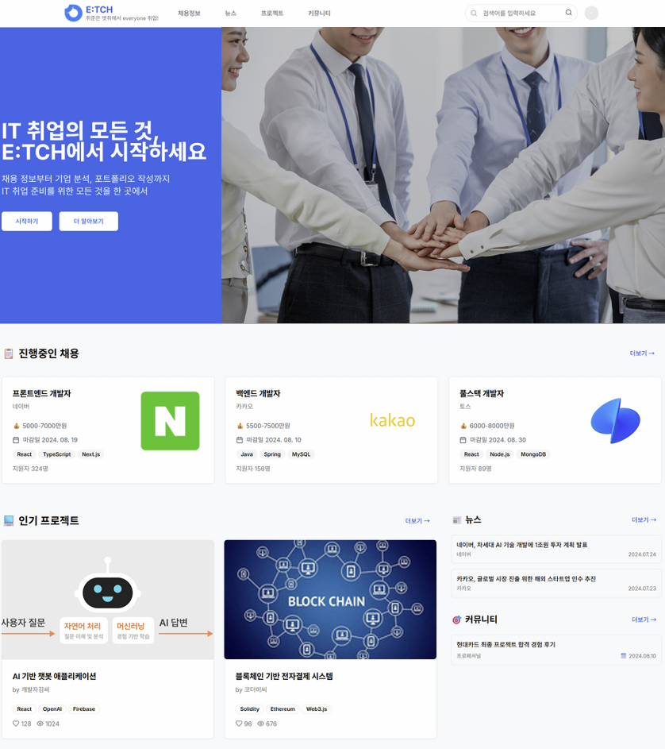
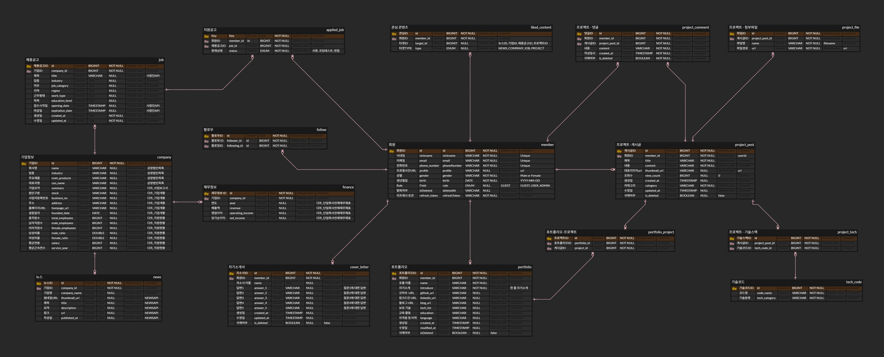
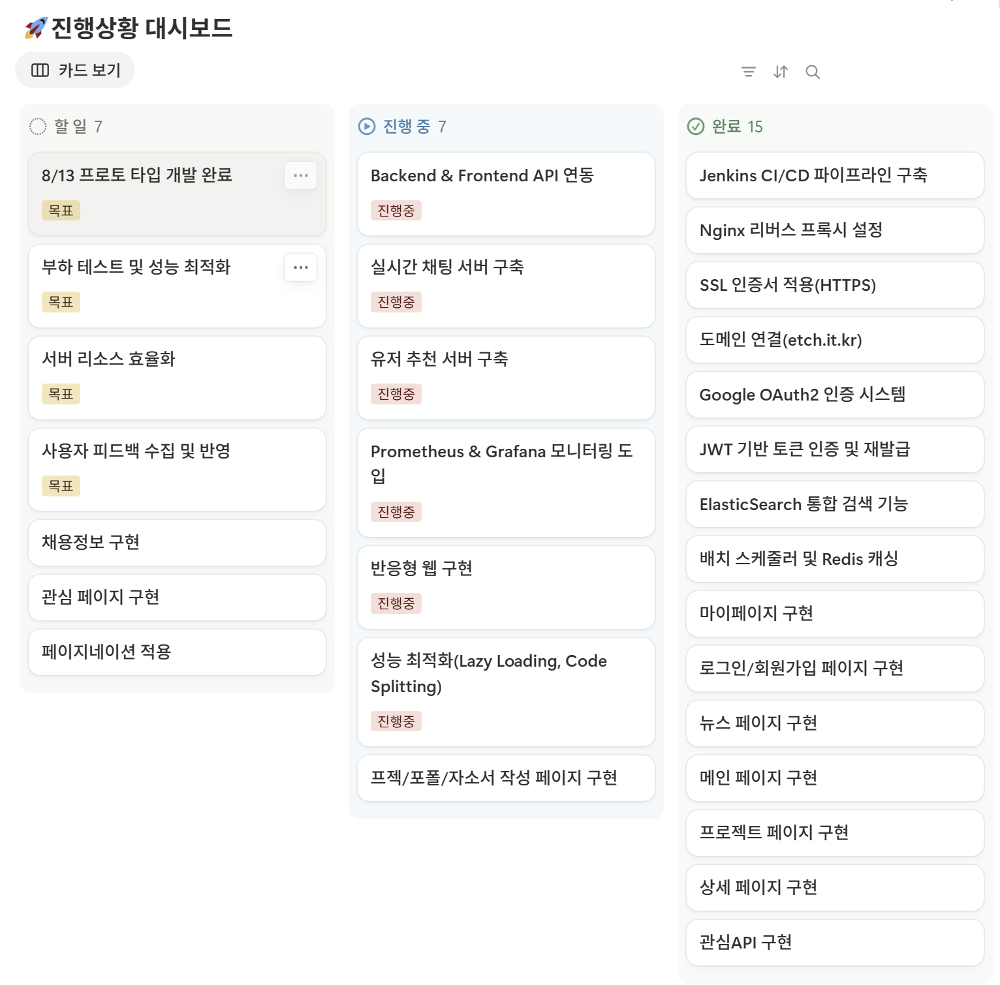

# ETCH (엣취!)-README

> ***“Everyone 취업!”***
IT 취업 준비생을 위한 통합 취업 지원 플랫폼
> 

프로젝트 기간 : 2025.07 ~ 2025.08

**[✨Notion README 보러가기✨](https://antique-beechnut-31b.notion.site/ETCH-README-248b4441359c80f38e5fccf2413416f6?source=copy_link)**

---

# 🔗프로젝트 링크

<aside>

💡[**ETCH - Everyone, 취업! 엣취!**](https://etch.it.kr)

</aside>

# 👥 팀 구성

| 역할 | 이름 | 담당 업무 |
| --- | --- | --- |
| **팀장 & 인프라** | **한승수** | **CI/CD 구축, 서버 관리, DevOps** |
| **백엔드 [리드]** | **김윤수** | **백엔드 아키텍처 설계, 핵심 API 개발** |
| **백엔드** | **이재빈** | **OAuth 인증, 추천 기능, API 개발** |
| **백엔드** | **이현지** | **배치 시스템, Redis 캐싱, 데이터 수집, API 개발** |
| **프론트엔드 [리드]** | **지성현** | **프론트엔드 아키텍처, UI/UX 설계** |
| **프론트엔드** | **김성민** | **컴포넌트 개발, 사용자 인터페이스 구현** |

---

# 📋프로젝트 관리

## [Jira↗️](https://ssafy.atlassian.net/jira/software/c/projects/S13P11A402/summary)

- 스프린트 기반 일정 관리
- BE/FE/Infra 별 업무 분담
- 스토리 포인트 기반 작업량 추정
- 매주 월요일 작업 계획 수립

## [GitLab Repo↗️](https://lab.ssafy.com/s13-webmobile1-sub1/S13P11A402)

- Git Flow 적용 (master, dev, feat)
- Jira task를 통한 branch 생성

## [Notion↗️](https://www.notion.so/22a1a1b1012f809f96ecefba833c1fe9?pvs=21)

- 프로젝트 회의록 및 공유 문서 관리
- 팀 규칙 (그라운드 룰, 회의 룰) 명시
- 컨벤션 정리 (Git, Code, Naming, Jira, DB)
- 명세서 관리 (기능, API, ERD)
- 환경변수 및 설정 값 관리

---

# ⚡주차별 업적

## 🗓1주차~2주차 - 주제 선정

<aside>

👉👉👉[아이디어 목록 보러가기](https://www.notion.so/2311a1b1012f80359794c9e6fbb9111d?pvs=21)👈👈👈

</aside>

- **주제 선정**: 13번의 주제 회의, 30개 아이디어 도출
- **최종 주제**: ***“통합 취업 지원 플랫폼 서비스”***
    
    > **ETCH (엣취!)**는 IT 취업 준비생들이 한 곳에서 모든 취업 준비를 할 수 있는 통합 플랫폼입니다. 채용 정보 제공부터 개인 맞춤 추천, 프로젝트 SNS, 자소서/포트폴리오 작성 지원까지 취업 준비에 필요한 모든 기능을 제공합니다.
    > 
    

## 📄3주차 - 명세서 작성

### **기능 명세서**

| 역할        | 통합 채용 정보                                                                                        | 맞춤형 콘텐츠 추천                                               | 프로젝트 SNS                                                   | 취준 어시스턴트                                                                      |
| --------- | ----------------------------------------------------------------------------------------------- | -------------------------------------------------------- | ---------------------------------------------------------- | ----------------------------------------------------------------------------- |
| 기능 명세서 작성 | - 다중 API (사람인 API, NewsAPI, DartAPI) 기반 데이터 수집 - ElasticSearch 기반 통합 검색 기능 - 실시간 채용 알림 전송 | - 사용자 관심 분야 및 활동 기반 추천 알고리즘 - 맞춤형 채용 공고, 뉴스, 기업 정보 제공 | - 프로젝트 공유 및 팀원 모집 플랫폼 - 커뮤니티 기반 개발자 네트워킹 - 실시간 채팅 기능 | - AI 기반 자기소개서/포트폴리오 작성 지원 - 개인 맞춤형 가이드라인 및 템플릿 제공 - 대시보드 기반 취업 준비 현황 분석 |

### **API 명세서**

<aside>

👉👉👉[API 명세서 보러가기](https://www.notion.so/API-2381a1b1012f80f0ab89f263fc8e5e40)👈👈👈

</aside>

### **UI/UX**

👉👉👉[Figma 디자인 보러가기](https://www.figma.com/design/TXWdGbbCtAk1VeMvMFNkPu/PTJ-Design?node-id=0-1&t=cOqejurYRzlPfRZZ-1)👈👈👈

### **ERD 설계**

👉👉👉[ERD CLOUD 보러가기](https://www.erdcloud.com/d/XmpLtdomNv7g7ZBu2)👈👈👈

## 🔧4주차 - CI/CD 구축 및 개발 시작

### Infrastructure
| 담당자 | 역할 | 주요 업무 |
|---|---|---|
| **한승수** | Infra | Jenkins CI/CD 파이프라인 구축, GitLab Webhook 연동, Nginx 리버스 프록시 설정 |

### Backend
| 담당자 | 역할 | 주요 업무 |
|---|---|---|
| **김윤수** (리더) | BusinessServer | 기본 CRUD 구현, ElasticSearch Test, ERD 조정 및 백엔드 업무 조정 |
| **이재빈** | BusinessServer | 기본 CRUD 구현, Google OAuth 연동, JWT Token 적용 |
| **이현지** | BatchServer | 기본 CRUD 구현, 주요 회사 정리, NewsAPI 서버 구축, Redis Top10 구현 |

### Frontend
| 담당자 | 역할 | 주요 업무 |
|---|---|---|
| **지성현** (리더) | FE Architecture | Atomic Design 패턴 적용, React Router 페이지 관리 |
| **김성민** | FE Development | Atomic Design 패턴 적용, React Router 페이지 관리 |

## 🎯5주차 - 집중 개발 기간

### Infrastructure
| 담당자 | 주요 업무 |
|---|---|
| **한승수** | prometheus와 grafana 모니터링 적용, 빌드/배포 시간 감축, 블루/그린 배포 적용 |

### Backend
| 담당자 | 역할 | 주요 업무 |
|---|---|---|
| **김윤수** (리더) | ElasticSearch & ChatServer | 검색 API 구현, ElasticSearch 적용, ChattingServer 작업, 프로젝트/뉴스/인기/채용/좋아요 API 연결, 주요 모달창 구현 |
| **이재빈** | RecommendServer | 자소서/포트폴리오 API 구현, RecommendServer 작업, 메인페이지 레이아웃 구현, OAuth 연결, 검색/뉴스/프로젝트/채용/파일 API 연결 |
| **이현지** | BusinessServer | ERD 정규화, JPQL 쿼리 작성 및 최적화, 프로젝트 API 구현 |

### Frontend
| 담당자 | 역할 | 주요 업무 |
|---|---|---|
| **지성현** (리더) | 페이지 개발 | 프로젝트/뉴스/인기/채용/좋아요 API 연결, 주요 모달창 구현 |
| **김성민** | OAuth & 페이지 | 메인페이지 레이아웃 구현, OAuth 연결, 검색/뉴스/프로젝트/채용/파일 API 연결 |

---

## 🛠기술 스택

| Programming Languages | TypeScript, Java, Python |
| --- | --- |
| Frameworks | React, Spring Boot, Spring Security, Oauth, JWT |
| Databases | MySQL, Redis, MinIO(S3) |
| Version Control | Git, GitLab, Jira |
| Cloud Services | EC2, MySQL(Azure) |
| Deployment Tools | Docker, DockerHub |
| CI/CD | Jenkins, Nginx |
| OpenSource | Elasticsearch |
| API | 뉴스API, 기업API, 채용API |
| Co-op | Jira, Figma, Notion, Git/GitLab |

---

## 🚀진행상황 대시보드

